# (C# 코딩) File Compare

## 개요
- C# 프로그래밍학습
- 1줄소개: 키보드와 마우스를 이용해 메뉴를 선택하고 주문할 수 있는 버거 주문 키오스크
- 사용한 플랫폼: 
    - C#, .NET Windows Forms, Visual Studio, GitHub
- 사용한 컨트롤:
    - Label, TextBox , Button, ListView , SplitContainer , Panel
- 사용한 기술과 구현한 기능:
    - Visual Studio를 이용하여 UI 디자인
    - FolderBrowserDialog를 이용한 폴더 선택 기능 구현
    - Directory 및 File 클래스를 활용한 파일 정보 읽기
    - 파일 비교를 통한 색상 구분 표시 기능 구현
    - 재귀 함수(Recursive)를 이용한 하위 폴더 처리

## 실행 화면 (과제1)
- 코드의 실행 스크린샷과 구현 내용 설명

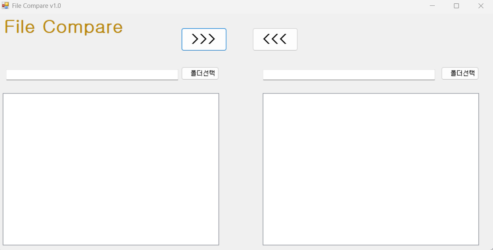
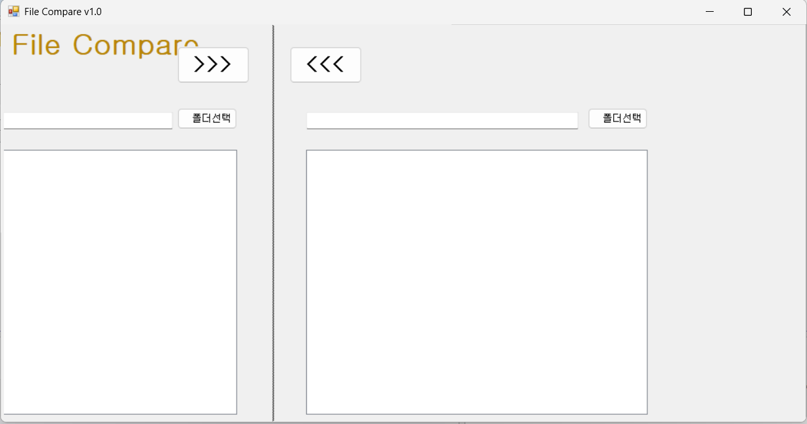
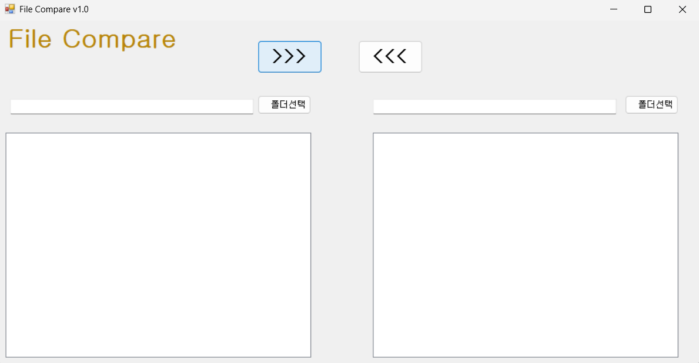
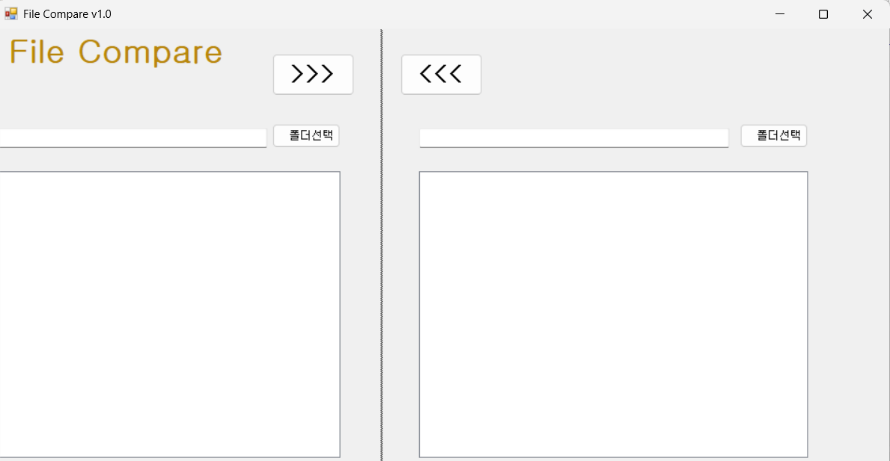

- 과제 내용
    - GUI 설계 및 적절히 컨트롤을 배치하였습니다.
    - 컨트롤 이름 설정 및 속성을 지정하였습니다.
    - 버튼 클릭 등 기본 이벤트 처리기능을 구현하였습니다.
    - 초기화 기능 구현

- 구현한 내용 (위 그림 참조)
    - Label, Button, ListBox, ListView 등을 이용하여 기본 UI 구성을 하였습니다.
    - 각 컨트롤의 Name 속성을 지정하여 코드 가독성을 향상하였습니다.
    - 버튼 클릭 이벤트를 통해 동작을 확인하는기능구현 (예: 메시지 출력)
    - 초기화 버튼을 통해 `ListBox` 및 상태를 초기 상태로 되돌리는 기능을 구현하였습니다.

## 실행 화면 (과제2)
- 코드의 실행 스크린샷과 구현 내용 설명

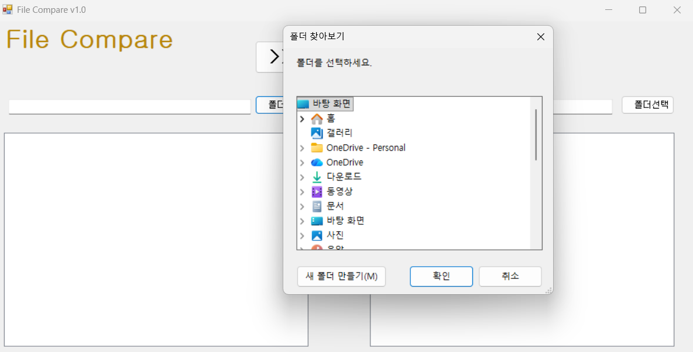
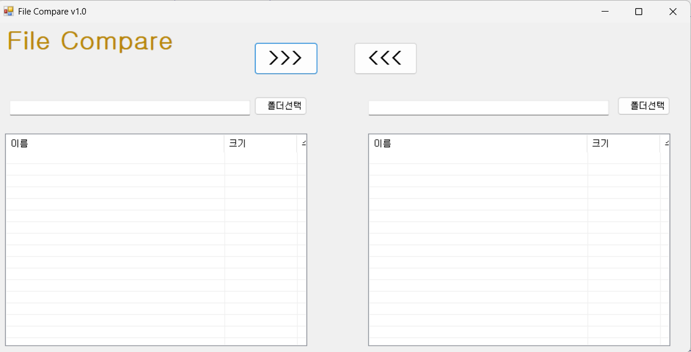
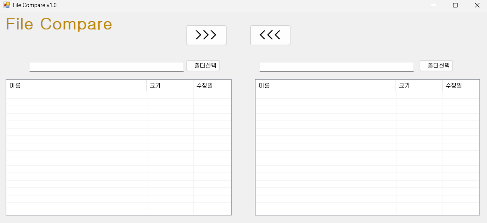
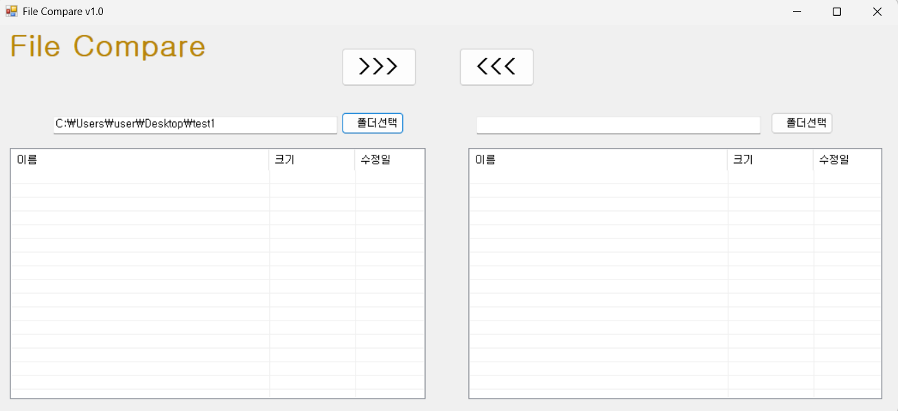

- 과제내용
    - 폴더 선택 기능을 구현하였습니다.
    - 선택된 폴더의 파일 리스트를 출력하였습니다.
    - 파일 상태에 따른 색상을 구분하였습니다.

- 구현한 내용 (위 그림 참조)
    - **FolderBrowserDialog**를 사용하여 좌/우 폴더 선택 기능을 구현하였습니다.
    - Directory.GetFiles()를 이용하여 파일 목록을 `ListBox`에 출력하였습니다.
    - 동일 파일 / 없는 파일 등을 비교하여 색상으로 구분하였습니다.
    - 양쪽 폴더의 파일을 동시에 비교하여 사용자에게 직관적으로 표시하였습니다.

## 실행 화면 (과제3)
- 코드의 실행 스크린샷과 구현 내용 설명

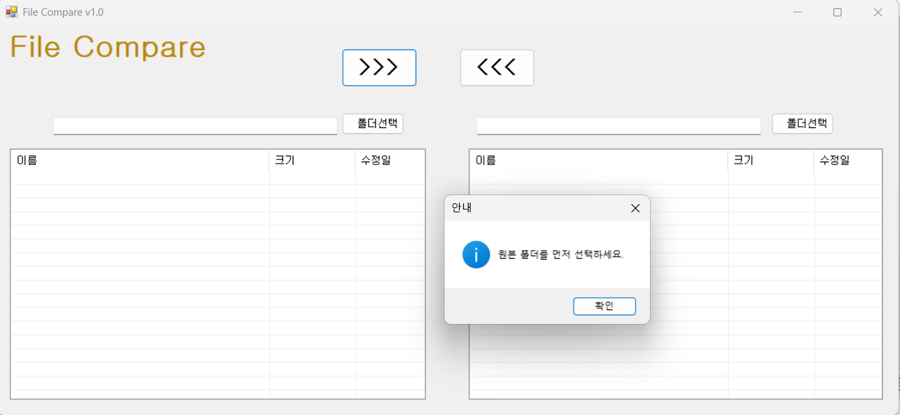
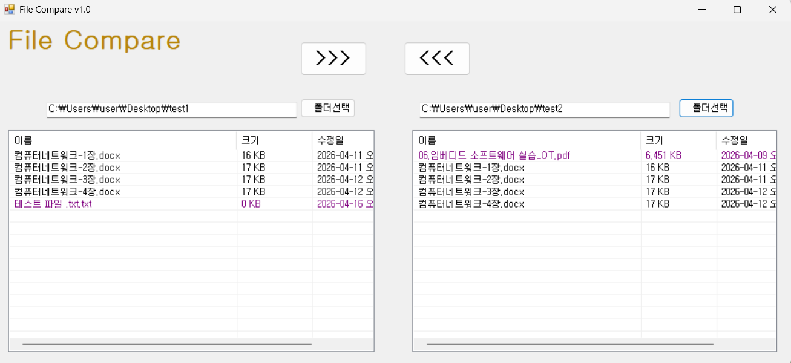
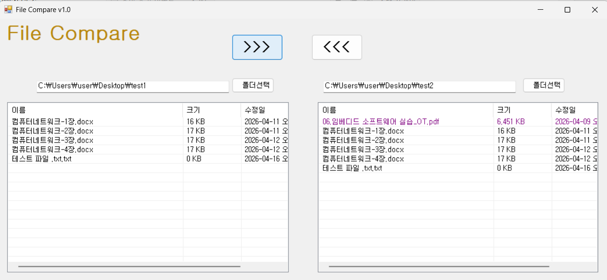
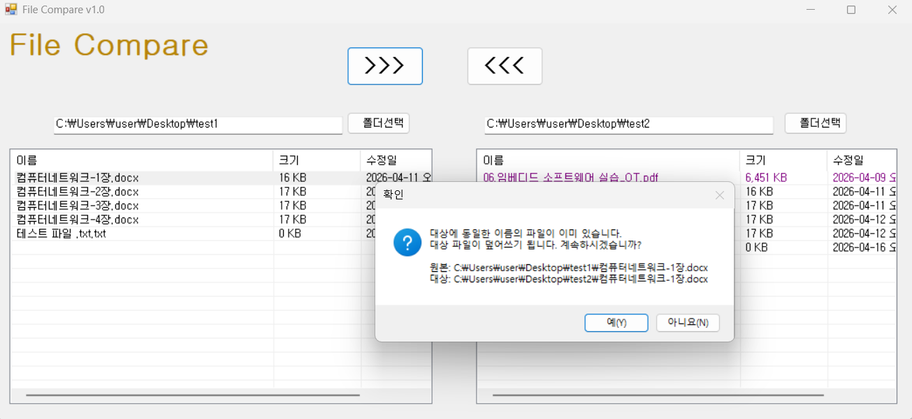

- 과제내용
    - 선택한 파일을 반대 폴더로 복사하는 기능구현
    - 수정 날짜 비교 후 사용자 확인
    - 복사 진행 여부를 결정

- 구현한 내용 (위 그림 참조)
    - `ListBox`에서 선택된 파일 정보를 가져와 대상 경로를 설정하는 기능
    - **File.Copy()** 를 이용하여 파일을 복사 기능 구현하는 기능
    - 기존 파일이 있을 경우 `MessageBox`로 사용자 확인 후 덮어쓰기를 진행하는 기능구현
    - 예외 처리(try-catch)를 통해 오류 발생 시 안정성 확보

## 실행 화면 (과제4)
- 코드의 실행 스크린샷과 구현 내용 설명

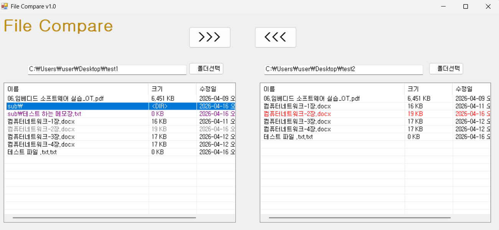
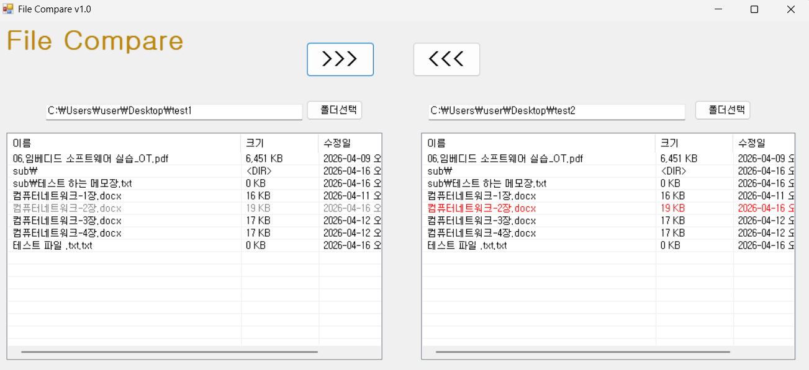
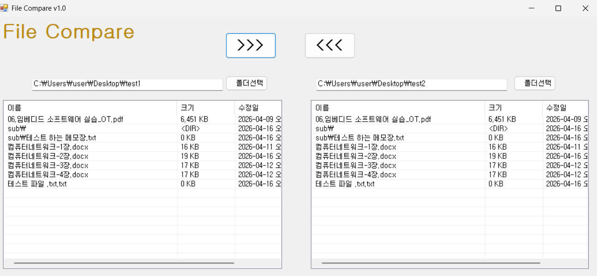
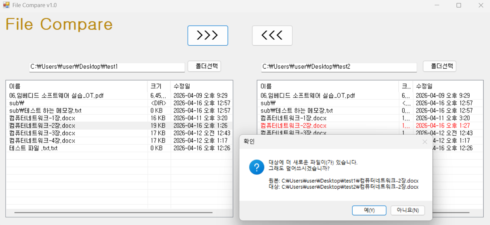

- 과제내용
    - 하위 폴더까지 포함한 비교 기능 구현
    - 폴더를 하나의 항목처럼 처리하는 기능 구현
    - 전체 복사 기능 구현

- 구현한 내용 (위 그림 참조)
    - **Directory.GetDirectories()** 를 이용하여 하위 폴더를 탐색하는 기능 구현
    - 재귀 함수(Recursive)를 사용하여 모든 하위 파일 및 폴더 순회
    - 폴더도 하나의 비교 단위로 처리하여 `ListBox`에 표시하는 기능 구현
    - 복사 버튼 클릭 시 하위 폴더까지 전체 복사 수행 구현